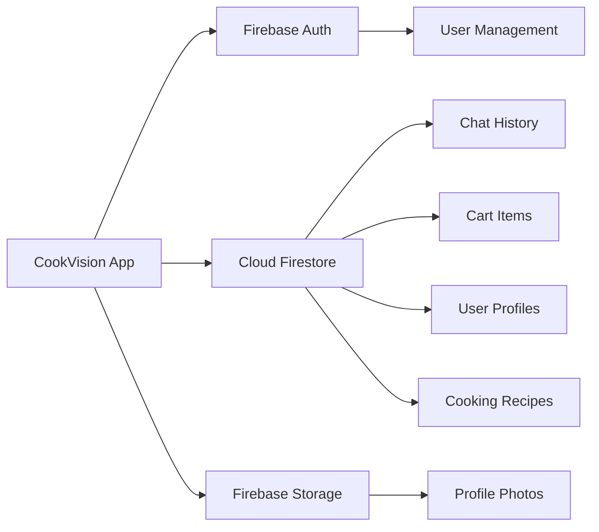
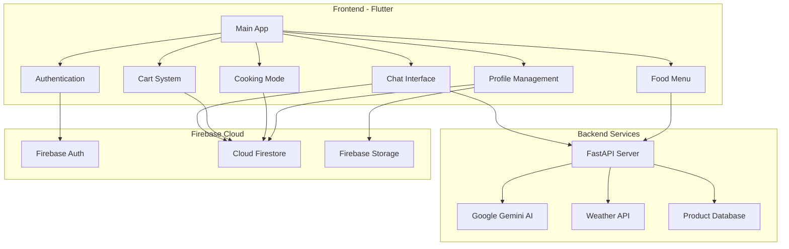
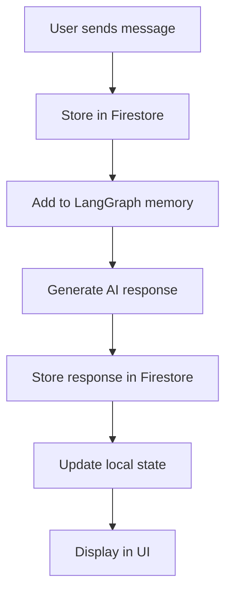

<div align="center">


<p align="center">
  
</p>

<p align="center">
  <a href="#"></a>
  <a href="#"></a>
  <a href="#"></a>
  <a href="#"></a>
</p>

<p align="center">
  <a href="#"></a>
  <a href="#"></a>
  <a href="#"></a>
  <a href="#"></a>
</p>

<p align="center">
  <em>🎯 Food ordering meets AI intelligence • 🌈 Beautiful gradients • ⚡ Lightning fast • 🔒 Secure authentication</em>
</p>

<p align="center">
  <a href="#-features">Features</a> •
  <a href="#-tech-stack">Tech Stack</a> •
  <a href="#-quick-start">Quick Start</a> •
  <a href="#-screenshots">Screenshots</a> •
  <a href="#-api">API</a> •
  <a href="#-contributing">Contributing</a>
</p>

</div>

---

---

## ✨ Features

<div align="center">

```ascii
╔══════════════════════════════════════════════════════════════════╗
║                    🎯 COOKVISION FEATURES                        ║
╚══════════════════════════════════════════════════════════════════╝
```

</div>

### 🔐 **Authentication & User Management**

<table>
<tr>
<td width="33%">

**🔑 Secure Login/Signup**
- Firebase Authentication
- Email/Password login
- Session persistence
- Password recovery

</td>
<td width="33%">

**👤 User Profile**
- Edit profile details
- Profile photo upload (Base64)
- Order history tracking
- Favorites management

</td>
<td width="33%">

**🏠 Address Management**
- Multiple saved addresses
- Default address selection
- Easy address editing
- Location-based delivery

</td>
</tr>
</table>

### 🤖 **AI & Smart Features**

<table>
<tr>
<td width="50%">

**💬 AI Chat Assistant**
- Powered by **Google Gemini 2.0 Flash**
- Natural language food queries
- Persistent chat history (Firebase)
- Context-aware responses
- Product recommendations
- Add to cart directly from chat

</td>
<td width="50%">

**🌤️ Weather Intelligence**
- Real-time location detection
- Weather-based meal suggestions
- City-level accuracy
- Automatic updates
- Seasonal recommendations
- Temperature-smart menus

</td>
</tr>
</table>

### 🍳 **Cooking & Food Discovery**

<table>
<tr>
<td width="33%">

**👨‍🍳 Cooking Mode**
- Step-by-step recipes
- Firebase recipe database
- Search by dish name
- Ingredient lists
- Cooking time estimates

</td>
<td width="33%">

**⏱️ Cooking Steps**
- Live countdown timer
- Visual progress tracking
- Step-by-step instructions
- Ingredient checklists
- Compact scrollable UI

</td>
<td width="33%">

**📸 Food Scanner**
- Camera capture
- Gallery upload
- Image preview
- AI recognition (coming soon)
- Smart ingredient detection

</td>
</tr>
</table>

### 🛒 **Shopping & Orders**

<table>
<tr>
<td width="33%">

**🛍️ Smart Menu**
- Browse food items
- Category filtering
- Cuisine sorting
- Price range filters
- Dietary preferences (Veg/Non-Veg)
- Rating & reviews

</td>
<td width="33%">

**🛒 Shopping Cart**
- Real-time cart updates
- Quantity management
- Price calculation
- Firebase sync
- Persistent cart
- One-tap checkout

</td>
<td width="33%">

**💳 Payment Integration**
- UPI payment support
- Multiple payment methods
- Secure transactions
- Order confirmation
- Payment history

</td>
</tr>
</table>

### 🎨 **Design & UX**

<div align="center">

| Feature | Description |
|---------|-------------|
| 🌈 **Gradient UI** | Beautiful purple-blue gradients throughout |
| 🌙 **Dark Theme** | Eye-friendly dark mode design |
| ✨ **Animations** | Smooth transitions and loading states |
| 📱 **Responsive** | Optimized for all screen sizes |
| 🎯 **Material 3** | Latest Material Design guidelines |
| ⚡ **Fast Loading** | Optimized performance |

</div>

### 🔥 **Firebase Integration**



<div align="center">

**✅ Real-time Database** • **✅ Secure Storage** • **✅ Cloud Functions** • **✅ Analytics Ready**

</div>

---

## 🛠️ Tech Stack

<div align="center">

### **Architecture Overview**



</div>

### 📱 **Frontend Technologies**

<table>
<tr>
<td width="50%">

**Flutter Framework**
```yaml
Flutter SDK: 3.24.0
Dart: >=3.0.0 <4.0.0
UI: Material Design 3
Theme: Custom Dark Gradients
State: StatefulWidget + Provider
```

</td>
<td width="50%">

**Core Packages**
```yaml
firebase_core: ^3.15.2
firebase_auth: ^5.7.0
cloud_firestore: ^5.6.12
firebase_storage: ^12.4.10
http: ^1.6.0
image_picker: ^1.2.1
```

</td>
</tr>
</table>

### 🔥 **Firebase Services**

<div align="center">

| Service | Purpose | Features Used |
|---------|---------|---------------|
| 🔐 **Firebase Auth** | User authentication | Email/Password, Session management |
| 📊 **Cloud Firestore** | NoSQL database | Real-time sync, Collections, Queries |
| 📦 **Firebase Storage** | File storage | Profile photos (Base64 alternative) |
| 📈 **Analytics** | Usage tracking | User behavior, Feature usage |

</div>

### 🧠 **Backend Technologies**

<table>
<tr>
<td width="33%">

**Python Stack**
- Python 3.13
- FastAPI framework
- Uvicorn server
- Async/await
- Type hints

</td>
<td width="33%">

**AI/ML Services**
- Google Gemini 2.0 Flash
- LangChain orchestration
- DeepAgents workflows
- LangGraph memory
- Context persistence

</td>
<td width="33%">

**Data & APIs**
- SQLite database
- Weather API
- Product search
- Dietary filters
- Price sorting

</td>
</tr>
</table>

### 📦 **Complete Dependency List**

<details>
<summary>Click to expand full package list</summary>

```yaml
dependencies:
  # Flutter Core
  flutter:
    sdk: flutter
  cupertino_icons: ^1.0.8
  
  # Firebase
  firebase_core: ^3.15.2
  firebase_auth: ^5.7.0
  cloud_firestore: ^5.6.12
  firebase_storage: ^12.4.10
  
  # AI & Chat
  google_generative_ai: ^0.4.7
  flutter_ai_toolkit: ^0.9.2
  
  # Networking & APIs
  http: ^1.6.0
  
  # Location Services
  geolocator: ^10.1.1
  geocoding: ^2.2.2
  
  # Media & Files
  image_picker: ^1.2.1
  
  # Utilities
  intl: ^0.18.1
  shared_preferences: ^2.5.3
  url_launcher: ^6.2.4
  
dev_dependencies:
  flutter_test:
    sdk: flutter
  flutter_lints: ^5.0.0
```

</details>

### 🎨 **Design System**

<div align="center">

**Color Palette**

| Type | Color | Hex | Usage |
|------|-------|-----|-------|
| 🟣 Primary | Purple | `#667eea` | Buttons, headers |
| 🔵 Secondary | Blue | `#764ba2` | Gradients, accents |
| ⚫ Background | Dark Navy | `#1a1a2e` | App background |
| 🌑 Surface | Dark Slate | `#2a2d3a` | Cards, containers |
| ⭐ Accent | Bright Blue | `#0f3460` | Highlights |

**Typography**
- Font Family: System Default (San Francisco/Roboto)
- Weights: 400 (Regular), 600 (Semibold), 700 (Bold)
- Sizes: 12px - 32px scale

</div>

## 🚀 Quick Start

<div align="center">

```ascii
╔════════════════════════════════════════════════════════════════╗
║  SETUP TAKES LESS THAN 5 MINUTES ⚡                            ║
╚════════════════════════════════════════════════════════════════╝
```

</div>

### 📋 Prerequisites

<table>
<tr>
<td width="25%">

**Flutter**
```bash
Flutter 3.24.0+
Dart 3.0.0+
```

</td>
<td width="25%">

**Python**
```bash
Python 3.13
pip/pip3
```

</td>
<td width="25%">

**Firebase**
```bash
Firebase project
Config files
```

</td>
<td width="25%">

**APIs**
```bash
Gemini API key
Weather API
```

</td>
</tr>
</table>

### 1️⃣ **Clone the Repository**

```bash
git clone https://github.com/khanak0509/CookVision.git
cd CookVision
```

### 2️⃣ **Firebase Setup** 🔥

<details>
<summary><b>Click to expand Firebase configuration steps</b></summary>

1. **Create a Firebase project** at [console.firebase.google.com](https://console.firebase.google.com)

2. **Enable services:**
   - ✅ Authentication (Email/Password)
   - ✅ Cloud Firestore
   - ✅ Firebase Storage (optional for Blaze plan)

3. **Download config files:**
   - Android: `google-services.json` → `android/app/`
   - iOS: `GoogleService-Info.plist` → `ios/Runner/`
   - macOS: `GoogleService-Info.plist` → `macos/Runner/`

4. **Run FlutterFire CLI:**
   ```bash
   flutter pub add firebase_core
   flutterfire configure
   ```

5. **Firestore Collections:**
   ```
   users/
   ├── {userId}/
   │   ├── chats/
   │   ├── cart_items/
   │   └── profile data
   
   food_items/
   ├── {productId}/
   │   └── product details
   
   cooking_steps/
   ├── {recipeId}/
   │   └── recipe data
   ```

</details>

### 3️⃣ **Backend Setup** 🐍

```bash
# Navigate to project directory
cd food_app

# Install Python dependencies
pip install fastapi uvicorn langchain-google-genai \
            langgraph-checkpoint-sqlite deepagents \
            python-dotenv requests

# Create environment file
cat > .env << EOF
GOOGLE_API_KEY=your_gemini_api_key_here
EOF

# Ensure products.json exists (sample data)
# File should be in project root

# Start the FastAPI server
python3 -m uvicorn main:app --reload
```

<div align="center">

**✅ Server running at** `http://localhost:8000`

Test it: [http://localhost:8000/health](http://localhost:8000/health)

</div>

### 4️⃣ **Flutter Setup** 📱

```bash
# Install Flutter dependencies
flutter pub get

# Clean build (if needed)
flutter clean

# Run on your device/emulator
flutter run
```

### 5️⃣ **Platform-Specific Configuration**

<details>
<summary><b>iOS Configuration</b></summary>

**Edit `ios/Runner/Info.plist`:**

```xml
<key>NSLocationWhenInUseUsageDescription</key>
<string>We need your location for weather-based food suggestions</string>

<key>NSCameraUsageDescription</key>
<string>Take photos of your food</string>

<key>NSPhotoLibraryUsageDescription</key>
<string>Choose photos from your gallery</string>

<key>NSLocationAlwaysUsageDescription</key>
<string>Get accurate weather data for your area</string>
```

**Minimum iOS version: 12.0**

</details>

<details>
<summary><b>Android Configuration</b></summary>

**Edit `android/app/src/main/AndroidManifest.xml`:**

```xml
<manifest>
    <uses-permission android:name="android.permission.INTERNET"/>
    <uses-permission android:name="android.permission.ACCESS_FINE_LOCATION"/>
    <uses-permission android:name="android.permission.ACCESS_COARSE_LOCATION"/>
    <uses-permission android:name="android.permission.CAMERA"/>
    <uses-permission android:name="android.permission.READ_EXTERNAL_STORAGE"/>
    <uses-permission android:name="android.permission.WRITE_EXTERNAL_STORAGE"/>
    
    <application
        android:usesCleartextTraffic="true">
        <!-- ... -->
    </application>
</manifest>
```

**Minimum SDK: 21 (Android 5.0)**

</details>

<details>
<summary><b>macOS Configuration</b></summary>

**Edit `macos/Runner/Info.plist`:**

```xml
<key>NSLocationUsageDescription</key>
<string>Location access for weather features</string>

<key>NSCameraUsageDescription</key>
<string>Camera access for food scanner</string>
```

**Edit `macos/Runner/DebugProfile.entitlements` and `Release.entitlements`:**

```xml
<key>com.apple.security.network.client</key>
<true/>
<key>com.apple.security.network.server</key>
<true/>
```

</details>

### 6️⃣ **Upload Initial Data** 📊

```bash
# Upload cooking recipes to Firestore
# Use Firebase Console or run upload script

# Recipe format:
{
  "chicken_biryani": {
    "id": 1,
    "name": "Chicken Biryani",
    "cuisine": "Indian",
    "steps": [...],
    "ingredients": [...]
  }
}
```

### 🔧 **Configuration for Physical Devices**

If running on a physical device, update the API URL:

```dart
// In chat.dart, food_screen.dart, etc.
// Change from:
'http://localhost:8000/...'

// To your computer's local IP:
'http://192.168.1.x:8000/...'

// Find your IP:
// macOS/Linux: ifconfig | grep "inet "
// Windows: ipconfig
```

### ✅ **Verify Installation**

<div align="center">

| Check | Command | Expected Result |
|-------|---------|-----------------|
| Flutter | `flutter doctor` | All checks pass ✅ |
| Python | `python3 --version` | 3.13.x |
| Backend | `curl http://localhost:8000/health` | `{"status": "ok"}` |
| Firebase | Open app → Login | Auth works ✅ |

</div>

### 🆘 **Troubleshooting**

<details>
<summary><b>Common Issues & Solutions</b></summary>

**Issue: Firebase not initialized**
```bash
# Run FlutterFire configure again
flutterfire configure --project=your-project-id
```

**Issue: Gradle build failed**
```bash
# Update Android Gradle Plugin
# Edit android/settings.gradle.kts
id("com.android.application") version "8.9.1" apply false
```

**Issue: Backend not connecting**
```bash
# Check if server is running
curl http://localhost:8000/health

# Restart server with verbose logs
python3 -m uvicorn main:app --reload --log-level debug
```

**Issue: Location permission denied**
```bash
# Go to device Settings → App → CookVision → Permissions
# Enable Location, Camera, Storage
```

</details>

## 🔌 API Documentation

<div align="center">

**Base URL:** `http://localhost:8000`

</div>

### **Endpoints Overview**

```mermaid
graph LR
    A[Flutter App] -->|Natural Language Query| B[/food_query]
    A -->|City Name| C[/weather]
    A -->|Weather Condition| D[/suggestions]
    A -->|Health Check| E[/health]
    
    B -->|Gemini AI| F[Smart Response + Products]
    C -->|Weather API| G[Temperature & Conditions]
    D -->|Algorithm| H[Food Recommendations]
    E --> I[Server Status]
```

### 📡 **API Endpoints**

#### 1. **Food Query** 🤖

```http
GET /food_query/{user_input}?session_id={session_id}
```

**Description:** AI-powered food search using natural language

**Parameters:**
- `user_input` (path): User's question or food query
- `session_id` (query): Unique session identifier for context persistence

**Example Request:**
```bash
curl "http://localhost:8000/food_query/I%20want%20spicy%20indian%20food?session_id=user_123"
```

**Response:**
```json
{
  "response": {
    "llm_ans": "I found some great spicy Indian options for you!",
    "product": [
      {
        "id": "135",
        "name": "Chicken Biryani",
        "price": 299,
        "cuisine": "Indian",
        "category": "Main Course",
        "dietary": "Non-Vegetarian",
        "spice_level": "Hot",
        "rating": 4.5,
        "description": "Aromatic basmati rice with tender chicken",
        "preparation_time": 45,
        "tags": ["spicy", "popular", "aromatic"]
      }
    ]
  },
  "session_id": "user_123"
}
```

---

#### 2. **Weather** 🌤️

```http
GET /weather/{city}
```

**Description:** Get current weather for a specific city

**Parameters:**
- `city` (path): City name

**Example Request:**
```bash
curl "http://localhost:8000/weather/Mumbai"
```

**Response:**
```json
{
  "city": "Mumbai",
  "temperature": 32,
  "condition": "Sunny",
  "humidity": 65,
  "wind_speed": 12,
  "description": "Clear sky with bright sunshine"
}
```

---

#### 3. **Food Suggestions** 🍕

```http
GET /suggestions/{weather}
```

**Description:** Get food recommendations based on weather

**Parameters:**
- `weather` (path): Weather condition (sunny, rainy, cold, hot)

**Example Request:**
```bash
curl "http://localhost:8000/suggestions/rainy"
```

**Response:**
```json
{
  "weather": "rainy",
  "suggestions": [
    {
      "name": "Hot Soup",
      "reason": "Warm and comforting on rainy days",
      "category": "Comfort Food"
    },
    {
      "name": "Pakoras",
      "reason": "Perfect snack with tea",
      "category": "Snacks"
    }
  ]
}
```

---

#### 4. **Health Check** ✅

```http
GET /health
```

**Description:** Check if server is running

**Example Request:**
```bash
curl "http://localhost:8000/health"
```

**Response:**
```json
{
  "status": "ok",
  "timestamp": "2025-12-04T10:30:00Z",
  "version": "1.0.0"
}
```

---

### 🔐 **Authentication** (Future)

```http
POST /auth/login
POST /auth/register
POST /auth/logout
```

*Currently handled by Firebase Auth on client side*

---

### 📊 **Rate Limits**

| Endpoint | Limit | Window |
|----------|-------|--------|
| `/food_query` | 100 requests | 1 minute |
| `/weather` | 60 requests | 1 minute |
| `/suggestions` | 120 requests | 1 minute |
| `/health` | Unlimited | - |

---

### 🧪 **Testing the API**

**Using cURL:**
```bash
# Health check
curl http://localhost:8000/health

# Weather
curl http://localhost:8000/weather/Delhi

# Food query
curl "http://localhost:8000/food_query/biryani?session_id=test123"
```

**Using Postman:**
1. Import the collection
2. Set base URL to `http://localhost:8000`
3. Test each endpoint

**Using Browser:**
- Health: [http://localhost:8000/health](http://localhost:8000/health)
- Weather: [http://localhost:8000/weather/Mumbai](http://localhost:8000/weather/Mumbai)
- Docs: [http://localhost:8000/docs](http://localhost:8000/docs) (FastAPI auto-docs)

---

### 📚 **Interactive API Documentation**

FastAPI provides auto-generated docs:

- **Swagger UI:** [http://localhost:8000/docs](http://localhost:8000/docs)
- **ReDoc:** [http://localhost:8000/redoc](http://localhost:8000/redoc)

<div align="center">

**✨ Try it out interactively in your browser!**

</div>

## 📁 Project Structure

```
CookVision/
│
├── 📱 lib/                          # Flutter source code
│   ├── 🏠 main.dart                 # App entry & initialization
│   ├── 🎯 MainScreen.dart           # Home screen (weather + scanner)
│   │
│   ├── 🔐 Authentication
│   │   ├── login.dart               # Login screen
│   │   ├── signup.dart              # Registration screen
│   │   └── auth_service.dart        # Firebase Auth logic
│   │
│   ├── 💬 Chat & AI
│   │   └── chat.dart                # AI chat interface (Gemini)
│   │
│   ├── 🍕 Food & Menu
│   │   ├── food_screen.dart         # Browse food menu
│   │   └── cart.dart                # Shopping cart
│   │
│   ├── 👨‍🍳 Cooking Features
│   │   ├── cooking_mode.dart        # Recipe search
│   │   └── cooking_steps.dart       # Step-by-step cooking
│   │
│   ├── 👤 User Profile
│   │   ├── profile.dart             # View profile
│   │   ├── edit_profile.dart        # Edit profile + photo
│   │   └── address_screen.dart      # Manage addresses
│   │
│   ├── 💳 Payment
│   │   └── upi.dart                 # UPI payment integration
│   │
│   ├── ℹ️ Info & Policies
│   │   ├── about_screen.dart        # About the app
│   │   └── privacy_policy_screen.dart
│   │
│   ├── 🔧 Services & Utils
│   │   ├── firebase_options.dart    # Firebase config (GITIGNORED)
│   │   ├── cart_items.dart          # Cart data model
│   │   └── insert_dataset/          # Data upload scripts
│   │
│   └── 🧪 test.dart                 # Test utilities
│
├── 🎨 assets/                       # Static assets
│   ├── image.png                    # Placeholder images
│   ├── products.json                # Food product database
│   └── cooking_recipes.json         # Recipe data
│
├── 🐍 Backend (Python)
│   ├── main.py                      # FastAPI server
│   ├── products.json                # Product data (backend)
│   ├── checkpoints.sqlite           # AI chat history
│   ├── .env                         # API keys (GITIGNORED)
│   └── __pycache__/                 # Python cache (GITIGNORED)
│
├── 🤖 Android
│   ├── build.gradle.kts             # Build configuration
│   ├── settings.gradle.kts          # Plugin versions
│   └── app/
│       ├── build.gradle.kts         # App-level build
│       └── google-services.json     # Firebase config (GITIGNORED)
│
├── 🍎 iOS
│   ├── Podfile                      # CocoaPods dependencies
│   ├── Runner.xcodeproj/            # Xcode project
│   └── Runner/
│       ├── Info.plist               # iOS permissions
│       └── GoogleService-Info.plist # Firebase config (GITIGNORED)
│
├── 💻 macOS
│   ├── Podfile                      # CocoaPods dependencies
│   └── Runner/
│       ├── Info.plist               # macOS permissions
│       └── GoogleService-Info.plist # Firebase config (GITIGNORED)
│
├── 🌐 Web
│   ├── index.html                   # Web entry point
│   └── manifest.json                # PWA manifest
│
├── 📄 Configuration Files
│   ├── pubspec.yaml                 # Flutter dependencies
│   ├── analysis_options.yaml        # Dart linter rules
│   ├── .gitignore                   # Git ignore rules
│   ├── firebase.json                # Firebase hosting config
│   └── .firebaserc                  # Firebase project
│
├── 🔒 Security
│   ├── SECURITY.md                  # Security guidelines
│   ├── check_secrets.sh             # Pre-commit security check
│   └── cleanup_sensitive_files.sh   # Remove tracked secrets
│
└── 📚 Documentation
    ├── README.md                    # This file
    ├── CHAT_HISTORY_EXPLAINED.md    # Chat system docs
    └── CHAT_QUICK_REF.md            # Quick reference
```

### 📊 **File Count Overview**

<div align="center">

| Category | File Count | Purpose |
|----------|------------|---------|
| 📱 **Dart Files** | 19 files | App logic & UI |
| 🐍 **Python Files** | 3 files | Backend API |
| 🎨 **Assets** | 3 files | Images & data |
| ⚙️ **Config Files** | 15+ files | Build & settings |
| 🔒 **Security** | 3 files | Secrets & checks |
| 📚 **Documentation** | 4 files | Guides & docs |

**Total Lines of Code:** ~10,000+ lines

</div>

### 🗂️ **Key File Descriptions**

#### **Core Application Files**

| File | Lines | Purpose | Key Features |
|------|-------|---------|--------------|
| `main.dart` | ~100 | App initialization | Firebase setup, routing |
| `MainScreen.dart` | ~500 | Home screen | Weather widget, scanner, navigation |
| `chat.dart` | ~700 | AI chat | Gemini integration, product cards |
| `food_screen.dart` | ~600 | Food menu | Filtering, sorting, cart |
| `cart.dart` | ~800 | Shopping cart | Real-time updates, Firebase sync |
| `cooking_steps.dart` | ~400 | Cooking guide | Timer, progress tracking |
| `profile.dart` | ~600 | User profile | Profile display, logout |
| `edit_profile.dart` | ~500 | Edit profile | Photo upload (Base64), Firebase |

#### **Backend Files**

| File | Purpose | Technologies |
|------|---------|-------------|
| `main.py` | FastAPI server | Gemini AI, LangChain, SQLite |
| `products.json` | Food database | 100+ products with details |
| `checkpoints.sqlite` | Chat persistence | Conversation history |

#### **Firebase Collections**

```
Firestore Structure:
├── users/
│   └── {userId}/
│       ├── name, email, photoBase64
│       ├── chats/ (subcollection)
│       │   └── {chatId}/
│       │       ├── user_message
│       │       ├── bot_response
│       │       └── products[]
│       └── cart_items/ (subcollection)
│           └── {productId}/
│               ├── name, price, quantity
│               └── all product details
│
├── food_items/
│   └── {productId}/
│       ├── name, price, rating
│       ├── category, cuisine, dietary
│       └── description, tags[]
│
└── cooking_steps/
    └── {recipeId}/
        ├── name, cuisine, steps[]
        └── ingredients[], prep_time
```

## 📸 Screenshots

<div align="center">

### **App Screens Preview**

<table>
<tr>
<td width="25%">

<p align="center"><b>Home Screen</b><br/>Weather + Scanner</p>
</td>
<td width="25%">

<p align="center"><b>AI Chat</b><br/>Gemini Assistant</p>
</td>
<td width="25%">

<p align="center"><b>Food Menu</b><br/>Browse & Filter</p>
</td>
<td width="25%">

<p align="center"><b>Shopping Cart</b><br/>Real-time Updates</p>
</td>
</tr>
<tr>
<td width="25%">

<p align="center"><b>Cooking Mode</b><br/>Recipe Search</p>
</td>
<td width="25%">

<p align="center"><b>Cooking Steps</b><br/>Live Timer</p>
</td>
<td width="25%">

<p align="center"><b>User Profile</b><br/>Photo Upload</p>
</td>
<td width="25%">

<p align="center"><b>Authentication</b><br/>Secure Login</p>
</td>
</tr>
</table>

*Replace placeholder images with actual screenshots*

</div>

---

## ⚙️ Configuration

### 🔧 **Backend URL Configuration**

For physical devices, update API endpoints:

```dart
// In chat.dart, food_screen.dart, MainScreen.dart

// ❌ Localhost (emulator only)
final url = 'http://localhost:8000/food_query/$text';

// ✅ Local network (physical device)
final url = 'http://192.168.1.x:8000/food_query/$text';

// Find your IP:
// macOS/Linux: ifconfig | grep "inet "
// Windows: ipconfig
```

### 🎨 **Theme Customization**

Edit color scheme in all screens:

```dart
// Primary gradient
LinearGradient(
  colors: [
    Color(0xFF667eea),  // Purple
    Color(0xFF764ba2),  // Deep purple
  ],
)

// Background gradient
LinearGradient(
  colors: [
    Color(0xFF1a1a2e),  // Dark navy
    Color(0xFF16213e),  // Navy blue
    Color(0xFF0f3460),  // Deep blue
  ],
)

// Surface color
Color(0xFF2a2d3a)  // Dark slate
```

### 🔐 **Environment Variables**

Create `.env` file in project root:

```env
# Google Gemini API
GOOGLE_API_KEY=AIza...

# Weather API (optional)
WEATHER_API_KEY=your_key

# Backend URL
API_BASE_URL=http://localhost:8000
```

---

## 🧠 Memory & Persistence

### **Chat Memory System**



**Features:**
- ✅ Session-based memory (per user)
- ✅ Context retention across restarts
- ✅ SQLite checkpoints (backend)
- ✅ Firestore sync (frontend)
- ✅ Conversation history

### **Cart Persistence**

```dart
// Auto-saves to Firestore
users/{userId}/cart_items/{productId}
├── quantity: 1
├── price: 299
├── name: "Pizza"
└── all product details
```

---

## 🤝 Contributing

<div align="center">

**We welcome contributions!** 🎉

</div>

### **How to Contribute**

1. **Fork the repository**
   ```bash
   git clone https://github.com/khanak0509/CookVision.git
   ```

2. **Create a feature branch**
   ```bash
   git checkout -b feature/amazing-feature
   ```

3. **Make your changes**
   - Follow Flutter/Dart style guide
   - Add comments for complex logic
   - Test on multiple devices

4. **Run tests**
   ```bash
   flutter test
   python -m pytest  # For backend
   ```

5. **Commit with meaningful message**
   ```bash
   git commit -m "✨ Add amazing feature"
   ```

6. **Push to your fork**
   ```bash
   git push origin feature/amazing-feature
   ```

7. **Open a Pull Request**
   - Describe your changes
   - Add screenshots if UI change
   - Reference any issues

### **Contribution Guidelines**

<table>
<tr>
<td width="50%">

**✅ Do's**
- Write clean, readable code
- Follow existing code style
- Add comments for complex logic
- Test thoroughly
- Update documentation
- Use meaningful commit messages

</td>
<td width="50%">

**❌ Don'ts**
- Don't commit API keys
- Don't break existing features
- Don't ignore linter warnings
- Don't skip testing
- Don't commit debug code
- Don't push directly to main

</td>
</tr>
</table>

### **Commit Message Convention**

```
✨ feat: Add new feature
🐛 fix: Fix bug
📚 docs: Update documentation
🎨 style: Improve UI/UX
♻️ refactor: Code refactoring
⚡ perf: Performance improvement
✅ test: Add tests
🔒 security: Security fix
```

### **Areas for Contribution**

- 🤖 AI improvements (better prompts, new features)
- 🎨 UI/UX enhancements
- 🧪 Unit & integration tests
- 📚 Documentation improvements
- 🌍 Internationalization (i18n)
- ♿ Accessibility features
- 🐛 Bug fixes
- ⚡ Performance optimizations

---

## 🐛 Known Issues & Roadmap

### **Known Issues**

- [ ] Image upload size limit (900KB for Base64)
- [ ] Firebase Storage requires Blaze plan for photos
- [ ] Backend requires local network for physical devices
- [ ] Weather API rate limiting

### **Roadmap** 🗺️

<table>
<tr>
<td width="33%">

**v1.1** (Current)
- [x] Firebase Auth
- [x] AI Chat
- [x] Cart System
- [x] Cooking Mode
- [x] Profile Management

</td>
<td width="33%">

**v1.2** (Next)
- [ ] Order history
- [ ] Payment gateway
- [ ] Push notifications
- [ ] Favorites list
- [ ] Search filters

</td>
<td width="33%">

**v2.0** (Future)
- [ ] Voice assistant
- [ ] AR food preview
- [ ] Social features
- [ ] Restaurant integration
- [ ] Delivery tracking

</td>
</tr>
</table>

---

## 📜 License

```
MIT License

Copyright (c) 2025 CookVision

Permission is hereby granted, free of charge, to any person obtaining a copy
of this software and associated documentation files (the "Software"), to deal
in the Software without restriction, including without limitation the rights
to use, copy, modify, merge, publish, distribute, sublicense, and/or sell
copies of the Software.

This project is for educational purposes.
```

---

## 🙏 Acknowledgments

<div align="center">

**Built with ❤️ using amazing technologies**

| Technology | Purpose | Thanks To |
|------------|---------|-----------|
| 🔵 Flutter | Cross-platform UI | Google |
| 🔥 Firebase | Backend services | Google |
| 🤖 Gemini AI | AI chat | Google DeepMind |
| ⚡ FastAPI | Python backend | Sebastián Ramírez |
| 🎨 Material Design | UI components | Google |

</div>

### **Special Thanks**

- 🌟 Google for Gemini AI API
- 🔥 Firebase team for amazing backend
- 💙 Flutter community
- 🐍 Python community
- 📚 Open source contributors

---

## 📞 Contact & Support

<div align="center">

### **Get in Touch**

<table>
<tr>
<td align="center" width="25%">
<a href="https://github.com/khanak0509">

<br/><b>@khanak0509</b>
</a>
</td>
<td align="center" width="25%">
<a href="mailto:your.email@example.com">

<br/><b>Email</b>
</a>
</td>
<td align="center" width="25%">
<a href="https://linkedin.com/in/yourprofile">

<br/><b>LinkedIn</b>
</a>
</td>
<td align="center" width="25%">
<a href="https://twitter.com/yourhandle">

<br/><b>Twitter</b>
</a>
</td>
</tr>
</table>

### **Report Issues**

Found a bug? Have a suggestion?

<a href="https://github.com/khanak0509/CookVision/issues/new">

</a>

</div>

---

## ⭐ Show Your Support

<div align="center">

**If you like this project, please give it a ⭐ on GitHub!**

<a href="https://github.com/khanak0509/CookVision">

</a>

### **Quick Stats**


</div>

---

<div align="center">

### **Made with 💜 by [Khanak](https://github.com/khanak0509)**


**🍽️ Happy Cooking with CookVision! 🍽️**

</div>


