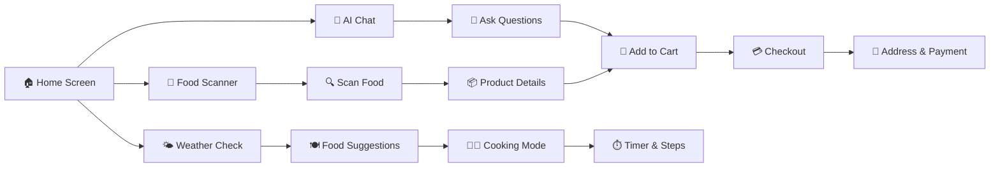

<div align="center">


<p align="center">
  
</p>

<p align="center"><em>Your AI-Powered Smart Food Companion with Beautiful Modern Design</em></p>


</div>

---

## ✨ Features

<div align="center">

<table>
<tr>
<td align="center" width="50%">

<h3>🤖 AI Chat Assistant</h3>
<p>Powered by <b>Google Gemini 2.0</b></p>
<p>Natural language queries • Product recommendations</p>
<p>WhatsApp-style UI • Persistent history • Add to cart from chat</p>
</td>
<td align="center" width="50%">

<h3>🌤️ Weather Intelligence</h3>
<p>Location-based suggestions</p>
<p>Weather-aware meals • Seasonal menus</p>
<p>Automatic updates</p>
</td>
</tr>

<tr>
<td align="center" width="50%">

<h3>👨‍🍳 Cooking Mode</h3>
<p>Step-by-step recipes</p>
<p>Live timer • Ingredient checklists</p>
<p>Progress tracking</p>
</td>
<td align="center" width="50%">

<h3>📸 Food Scanner</h3>
<p>Camera & gallery support</p>
<p>Image preview • AI recognition</p>
<p>Instant product details</p>
</td>
</tr>

<tr>
<td align="center" width="50%">

<h3>🛒 Smart Cart</h3>
<p>Real-time Firebase sync</p>
<p>Quantity management • Price calculation</p>
<p>Persistent across sessions</p>
</td>
<td align="center" width="50%">

<h3>🔐 Secure Auth</h3>
<p>Firebase Authentication</p>
<p>Profile management • Photo upload</p>
<p>Address management</p>
</td>
</tr>
</table>

</div>

---

## 🎨 Modern UI Design

<div align="center">

### **Beautiful Gradient Themes**

<table>
<tr>
<td align="center" width="50%">
<h4>🌙 Dark Mode</h4>
<p>• Deep blue/indigo gradient backgrounds</p>
<p>• Vibrant primary colors (Indigo, Purple, Cyan)</p>
<p>• Smooth animations & transitions</p>
<p>• Card glow effects</p>
</td>
<td align="center" width="50%">
<h4>☀️ Light Mode</h4>
<p>• Soft blue-gray backgrounds (#F8FAFC)</p>
<p>• Clean, professional appearance</p>
<p>• Excellent contrast & readability</p>
<p>• Subtle shadows</p>
</td>
</tr>
</table>

### **Design Highlights**

✨ **Clean Chat Interface** - WhatsApp-style message bubbles with avatars  
🎯 **Interactive Cards** - Ripple effects, scale animations, gradient borders  
🔄 **Theme Toggle** - Seamless switching between light and dark modes  
📱 **Modern Components** - Gradient buttons, rounded corners, smooth shadows  
🎭 **Consistent Styling** - Unified color palette across all screens  

</div>

---

## 🎯 App Workflow


```mermaid
graph LR
    A[🏠 Home Screen] --> B[🌤️ Weather Check]
    B --> C[🍽️ Food Suggestions]
    A --> D[🤖 AI Chat]
    D --> E[💬 Ask Questions]
    E --> F[🛒 Add to Cart]
    A --> G[📸 Food Scanner]
    G --> H[🔍 Scan Food]
    H --> I[📦 Product Details]
    I --> F
    C --> J[👨‍🍳 Cooking Mode]
    J --> K[⏱️ Timer & Steps]
    F --> L[💳 Checkout]
    L --> M[📍 Address & Payment]
```

---

## 🚀 Quick Start

<details>
<summary><b>📱 Flutter Setup</b></summary>

```bash
# Clone repository
git clone https://github.com/khanak0509/CookVision.git
cd CookVision/food_app

# Install dependencies
flutter pub get

# Run the app
flutter run
```

</details>

<details>
<summary><b>🐍 Backend Setup</b></summary>

```bash
# Navigate to project directory
cd food_app

# Install Python dependencies
pip install -r requirements.txt

# Create .env file with your API key
echo "GOOGLE_API_KEY=your_gemini_api_key_here" > .env

# Start FastAPI server
python3 -m uvicorn main:app --reload

# Server will run on http://localhost:8000
```

</details>

<details>
<summary><b>🔥 Firebase Setup</b></summary>

1. Create project at [Firebase Console](https://console.firebase.com)
2. Enable these services:
   - ✅ Authentication (Email/Password)
   - ✅ Cloud Firestore
   - ✅ Cloud Storage
3. Download configuration files:
   - **Android**: `google-services.json` → `android/app/`
   - **iOS**: `GoogleService-Info.plist` → `ios/Runner/`
4. Run Firebase CLI: `flutterfire configure`
5. Update Firestore rules for security

</details>

---

## 📁 Project Structure

```
CookVision/
├── 📱 lib/
│   ├── main.dart                    # App entry point
│   ├── MainScreen.dart              # Home with weather widget
│   ├── chat.dart                    # AI chat with modern UI
│   ├── cooking_mode.dart            # Step-by-step cooking
│   ├── cart.dart                    # Shopping cart
│   ├── profile.dart                 # User profile with theme toggle
│   ├── edit_profile.dart            # Profile editing
│   ├── food_screen.dart             # Food browsing
│   ├── food_recognition_service.dart # Camera & scanning
│   ├── theme/
│   │   ├── app_colors.dart          # Color palette & gradients
│   │   ├── app_spacing.dart         # Spacing constants
│   │   └── app_text_styles.dart     # Typography
│   └── widgets/
│       ├── custom_button.dart       # Reusable buttons
│       ├── food_card.dart           # Food item cards
│       └── premium_food_card.dart   # Enhanced cards
│
├── 🐍 Backend/
│   ├── main.py                      # FastAPI server
│   ├── requirements.txt             # Python dependencies
│   └── products.json                # Food database
│
├── 🎨 assets/
│   ├── products.json                # Product catalog
│   └── cooking_recipes.json         # Recipe database
│
├── 🔥 Firebase/
│   ├── google-services.json         # Android config
│   └── GoogleService-Info.plist     # iOS config
│
└── 📝 Configuration/
    ├── pubspec.yaml                 # Flutter dependencies
    ├── analysis_options.yaml        # Dart linting
    └── firebase.json                # Firebase config
```

---

## 🔌 API Endpoints

<div align="center">

| Endpoint | Method | Description | Response |
|----------|--------|-------------|----------|
| `/food_query/{text}` | GET | AI-powered food queries | Product recommendations + AI response |
| `/weather/{city}` | GET | Get weather data | Temperature, conditions, location |
| `/suggestions/{weather}` | GET | Weather-based food suggestions | Curated food list |
| `/health` | GET | Server health check | Status message |

**📚 Interactive API Docs:** [http://localhost:8000/docs](http://localhost:8000/docs)

</div>


## 🔧 Tech Stack

<div align="center">

### Frontend
- **Flutter 3.24.0** - Cross-platform mobile framework
- **Dart** - Programming language
- **Material Design 3** - Modern UI components

### Backend
- **Python 3.13** - Server language
- **FastAPI** - High-performance API framework
- **LangChain** - LLM orchestration
- **LangGraph** - Workflow management
- **Google Gemini 2.0** - AI model

### Database & Auth
- **Firebase Firestore** - NoSQL cloud database
- **Firebase Auth** - User authentication
- **Firebase Storage** - Image storage

### Additional
- **Weather API** - Real-time weather data
- **Image Picker** - Camera & gallery access

</div>

---

## 📱 Key Screens

1. **🏠 Home Screen** - Weather widget, food suggestions, navigation
2. **💬 Chat Screen** - AI assistant with WhatsApp-style UI, product recommendations
3. **🍽️ Food Screen** - Browse products with animated cards
4. **🛒 Cart** - Real-time cart management with Firebase sync
5. **👤 Profile** - User details, theme toggle, address management
6. **✏️ Edit Profile** - Update name, phone, profile photo
7. **📸 Food Recognition** - Camera scanning with AI detection
8. **👨‍🍳 Cooking Mode** - Step-by-step recipes with timers
9. **💳 Checkout** - Address selection and order placement

---

## 🚀 Features in Detail

### 🤖 AI Chat Assistant
- **Natural conversations** with Google Gemini 2.0
- **Product recommendations** based on queries
- **Chat history** persisted in Firebase
- **Add to cart** directly from chat
- **Modern UI** with message bubbles and avatars

### 🌤️ Weather Integration
- **Automatic location detection**
- **Weather-based food suggestions**
- **Real-time updates**
- **Beautiful weather cards**

### 📸 Food Recognition
- **Camera & gallery support**
- **AI-powered food detection**
- **Image preview**
- **Instant product details**

### 🛒 Smart Cart
- **Real-time Firebase sync**
- **Quantity adjustments**
- **Price calculations**
- **Persistent across devices**

### 👨‍🍳 Cooking Mode
- **Step-by-step instructions**
- **Built-in timers**
- **Ingredient checklists**
- **Progress tracking**

---

## 🎯 Future Enhancements

- [ ] Order tracking with real-time updates
- [ ] Payment gateway integration
- [ ] Social features (share recipes, reviews)
- [ ] Nutrition tracking
- [ ] Meal planning calendar
- [ ] Voice commands for cooking mode
- [ ] Offline mode support
- [ ] Multi-language support

---

