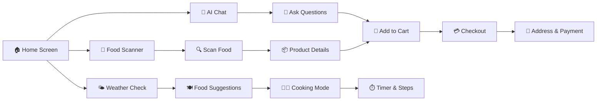

<div align="center">


<p align="center">
  
</p>

<p align="center"><em>Your AI-Powered Smart Food Companion with Beautiful Modern Design</em></p>


</div>

---

## ✨ Features

<div align="center">

<table>
<tr>
<td align="center" width="50%">

<h3>🤖 AI Chat Assistant</h3>
<p>Powered by <b>Google Gemini 2.0</b></p>
<p>Natural language queries • Product recommendations</p>
<p> Persistent history • Add to cart from chat</p>
</td>
<td align="center" width="50%">

<h3>🌤️ Weather Intelligence</h3>
<p>Location-based suggestions</p>
<p>Weather-aware meals • Seasonal menus</p>
<p>Automatic updates</p>
</td>
</tr>

<tr>
<td align="center" width="50%">

<h3>👨‍🍳 Cooking Mode</h3>
<p>Step-by-step recipes</p>
<p>Live timer • Ingredient checklists</p>
<p>Progress tracking</p>
</td>
<td align="center" width="50%">

<h3>📸 Food Scanner</h3>
<p>Deep Learning Model (EfficientNetB0)</p>
<p>Camera & gallery • AI recognition • Confidence scores</p>
<p>Top-5 predictions • Custom training</p>
</td>
</tr>

<tr>
<td align="center" width="50%">

<h3>🛒 Smart Cart</h3>
<p>Real-time Firebase sync</p>
<p>Quantity management • Price calculation</p>
<p>Persistent across sessions</p>
</td>
<td align="center" width="50%">

<h3>🔐 Secure Auth</h3>
<p>Firebase Authentication</p>
<p>Profile management • Photo upload</p>
<p>Address management</p>
</td>
</tr>
</table>

</div>

---

## 🎯 App Workflow


```mermaid
graph LR
    A[🏠 Home Screen] --> B[🌤️ Weather Check]
    B --> C[🍽️ Food Suggestions]
    A --> D[🤖 AI Chat]
    D --> E[💬 Ask Questions]
    E --> F[🛒 Add to Cart]
    A --> G[📸 Food Scanner]
    G --> H[🔍 Scan Food]
    H --> I[📦 Product Details]
    I --> F
    C --> J[👨‍🍳 Cooking Mode]
    J --> K[⏱️ Timer & Steps]
    F --> L[💳 Checkout]
    L --> M[📍 Address & Payment]
```

---

## 🚀 Quick Start

<details>
<summary><b>📱 Flutter Setup</b></summary>

```bash
# Clone repository
git clone https://github.com/khanak0509/CookVision.git
cd CookVision/food_app

# Install dependencies
flutter pub get

# Run the app
flutter run
```

</details>

<details>
<summary><b>🐍 Backend Setup</b></summary>

```bash
# Navigate to project directory
cd food_app

# Install Python dependencies
pip install -r requirements.txt

# Create .env file with your API key
echo "GOOGLE_API_KEY=your_gemini_api_key_here" > .env

# Start FastAPI server
python3 -m uvicorn main:app --reload

# Server will run on http://localhost:8000
```

</details>

<details>
<summary><b>🔥 Firebase Setup</b></summary>

1. Create project at [Firebase Console](https://console.firebase.com)
2. Enable these services:
   - ✅ Authentication (Email/Password)
   - ✅ Cloud Firestore
   - ✅ Cloud Storage
3. Download configuration files:
   - **Android**: `google-services.json` → `android/app/`
   - **iOS**: `GoogleService-Info.plist` → `ios/Runner/`
4. Run Firebase CLI: `flutterfire configure`
5. Update Firestore rules for security

</details>

<details>
<summary><b>🤖 Food Recognition Model Setup</b></summary>

```bash
# 1. Check if model is ready
python3 check_model.py

# 2. If model not found, train it
# Open train.ipynb in Jupyter or VS Code and run all cells
# Training takes 30-60 minutes

# 3. Verify model files exist
ls -lh food_recognition_model.h5 food_labels.json

# 4. Model is automatically loaded when backend starts
python3 -m uvicorn main:app --reload
# Look for: "✅ Food recognition model loaded"
```

**📚 Detailed Guide:** See [FOOD_RECOGNITION_SETUP.md](FOOD_RECOGNITION_SETUP.md)

</details>

---