<div align="center">


<p align="center">
  
</p>

<p align="center"><em>Your AI-Powered Smart Food Companion</em></p>


</div>

---

## ✨ Features

<div align="center">

<table>
<tr>
<td align="center" width="50%">

<h3>🤖 AI Chat Assistant</h3>
<p>Powered by <b>Google Gemini 2.0</b></p>
<p>Natural language queries • Product recommendations</p>
<p>Persistent history • Add to cart from chat</p>
</td>
<td align="center" width="50%">

<h3>🌤️ Weather Intelligence</h3>
<p>Location-based suggestions</p>
<p>Weather-aware meals • Seasonal menus</p>
<p>Automatic updates</p>
</td>
</tr>

<tr>
<td align="center" width="50%">

<h3>👨‍🍳 Cooking Mode</h3>
<p>Step-by-step recipes</p>
<p>Live timer • Ingredient checklists</p>
<p>Progress tracking</p>
</td>
<td align="center" width="50%">

<h3>📸 Food Scanner</h3>
<p>Camera & gallery support</p>
<p>Image preview • AI recognition</p>
<p><em></em></p>
</td>
</tr>

<tr>
<td align="center" width="50%">

<h3>🛒 Smart Cart</h3>
<p>Real-time Firebase sync</p>
<p>Quantity management • Price calculation</p>
<p>Persistent across sessions</p>
</td>
<td align="center" width="50%">

<h3>🔐 Secure Auth</h3>
<p>Firebase Authentication</p>
<p>Profile management • Photo upload</p>
<p>Address management</p>
</td>
</tr>
</table>

</div>

---

## � App Workflow

```mermaid
graph LR
    A[🏠 Home Screen] --> B[🌤️ Weather Check]
    B --> C[🍽️ Food Suggestions]
    A --> D[🤖 AI Chat]
    D --> E[💬 Ask Questions]
    E --> F[🛒 Add to Cart]
    A --> G[📸 Food Scanner]
    G --> H[🔍 Scan Food]
    H --> I[📦 Product Details]
    I --> F
    C --> J[👨‍🍳 Cooking Mode]
    J --> K[⏱️ Timer & Steps]
    F --> L[💳 Checkout]
    L --> M[📍 Address & Payment]
```



---

## �🚀 Quick Start

<details>
<summary><b>📱 Flutter Setup</b></summary>

```bash
# Clone repository
git clone https://github.com/khanak0509/CookVision.git
cd CookVision

# Install dependencies
flutter pub get

# Run the app
flutter run
```

</details>

<details>
<summary><b>🐍 Backend Setup</b></summary>

```bash
# Install Python dependencies
pip install fastapi uvicorn langchain-google-genai

# Create .env file
echo "GOOGLE_API_KEY=your_key_here" > .env

# Start server
python3 -m uvicorn main:app --reload
```

</details>

<details>
<summary><b>🔥 Firebase Setup</b></summary>

1. Create project at [Firebase Console](https://console.firebase.google.com)
2. Enable Authentication, Firestore, Storage
3. Download config files:
   - Android: `google-services.json` → `android/app/`
   - iOS: `GoogleService-Info.plist` → `ios/Runner/`
4. Run: `flutterfire configure`

</details>


## 📁 Project Structure

```
CookVision/
├── 📱 lib/
│   ├── main.dart              # App entry
│   ├── MainScreen.dart        # Home with weather
│   ├── chat.dart              # AI chat
│   ├── cooking_mode.dart      # Recipes
│   ├── cart.dart              # Shopping cart
│   ├── profile.dart           # User profile
│   └── ...
├── 🐍 Backend/
│   ├── main.py                # FastAPI server
│   └── products.json          # Food database
├── 🎨 assets/
│   ├── products.json
│   └── cooking_recipes.json
└── 🔥 Firebase config files
```

---

## 🔌 API Endpoints

<div align="center">

| Endpoint | Method | Description |
|----------|--------|-------------|
| `/food_query/{text}` | GET | AI chat query |
| `/weather/{city}` | GET | Weather data |
| `/suggestions/{weather}` | GET | Food suggestions |
| `/health` | GET | Server status |

**📚 Interactive Docs:** [http://localhost:8000/docs](http://localhost:8000/docs)

</div>
